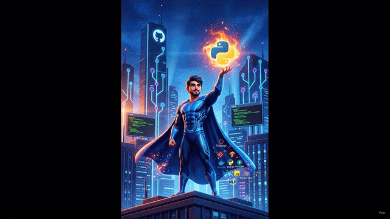

<!-- ═══════════════════════════════════════════════════════════════ -->
<!--                      WAVE HEADER BANNER                       -->
<!-- ═══════════════════════════════════════════════════════════════ -->


<!-- ═══════════════════════════════════════════════════════════════ -->
<!--                        HERO SECTION                           -->
<!-- ═══════════════════════════════════════════════════════════════ -->

<div align="center">

<h1>
   &nbsp;Hi, I'm Mahesh Godike
</h1>

<a href="https://git.io/typing-svg">
  
</a>

<br/>
<br/>

> *"Turning pixels, sensor data, and language into intelligent systems — from edge devices to enterprise."*

<br/>

<!-- SOCIAL LINKS -->
<a href="https://github.com/godikemahesh">
  
</a>&nbsp;
<a href="https://linkedin.com/in/mahesh-godike-647a12214">
  
</a>&nbsp;
<a href="https://instagram.com/mahesh_godike">
  
</a>&nbsp;
<a href="https://maheshgodike.netlify.app">
  
</a>&nbsp;
<a href="mailto:maheshgodike17@gmail.com">
  
</a>

<br/>
<br/>


</div>

---

<!-- ═══════════════════════════════════════════════════════════════ -->
<!--                      ANIMATED GIF / DEMO                      -->
<!-- ═══════════════════════════════════════════════════════════════ -->

<div align="center">
  
</div>

---

<!-- ═══════════════════════════════════════════════════════════════ -->
<!--                         ABOUT ME                              -->
<!-- ═══════════════════════════════════════════════════════════════ -->

## 🧑‍💻 About Me

```yaml
👤  Name        : Mahesh Godike
🏢  Role        : AI & Computer Vision Engineer
🏬  Company     : Valkontek Embedded & IoT Services Pvt. Ltd.
📍  Location    : Hyderabad, India 🇮🇳
💼  Experience  : 1+ year (production AI systems, promoted intern → full-time)
🎓  Education   : B.Tech in AI & ML 

🎯  Focus Areas :
      ▸  Computer Vision  → YOLO, SegFormer, DeepLabV3, UNet, ByteTrack, Re-ID
      ▸  LLMs & GenAI     → RAG Pipelines, LoRA/PEFT Fine-tuning, Agentic AI
      ▸  Edge AI          → NVIDIA Jetson AGX Orin, TensorRT, Raspberry Pi
      ▸  MLOps & Deploy   → Docker, FastAPI, GitHub, Edge Inference Optimization

🔭  Currently   :
      ▸  Automated Vehicle Inspection System (Edge CV + Jetson)
      ▸  Enterprise RAG Knowledge System (LangChain + ChromaDB/FAISS)
      ▸  Agentic AI WorkTracker (LangChain Agents + Automation)
      ▸  NutriBot LLM (IBM Granite 2B fine-tuned with LoRA/PEFT)

📢  Content     : Portfolio  → maheshgodike.netlify.app
                  Instagram  → @mahesh_godike

💬  Ask Me About:
      ▸  Production Computer Vision pipelines (detection + segmentation)
      ▸  LLM fine-tuning with LoRA / PEFT on custom datasets
      ▸  Deploying AI models to NVIDIA Jetson AGX Orin (TensorRT)
      ▸  Building RAG systems with LangChain + Vector Databases
      ▸  Agentic AI architecture & LangChain tool-calling
      ▸  IoT + ML integration on Raspberry Pi
```

---

<!-- ═══════════════════════════════════════════════════════════════ -->
<!--                   CURRENTLY WORKING ON                        -->
<!-- ═══════════════════════════════════════════════════════════════ -->

## 🎯 Currently Working On

<table>
<tr>
<td width="50%" valign="top">

### 🔭 Active Projects
| Project | Stack |
|---|---|
| 🚗 **Vehicle Inspection AI** | YOLOv8 + SegFormer + Jetson AGX |
| 🔍 **Enterprise RAG System** | LangChain + ChromaDB + FAISS |
| 🤖 **WorkTracker AI Agent** | LangChain Agents + Python |
| 🥗 **NutriBot LLM** | IBM Granite 2B + LoRA/PEFT |
| 👥 **Person Re-ID Pipeline** | ByteTrack + StrongSORT + FastAPI |

</td>
<td width="50%" valign="top">

### 📚 Currently Learning
- 🧠 Advanced multi-agent LLM frameworks
- ⚡ TensorRT FP16/INT8 optimization strategies
- 🔗 LangGraph & complex agentic workflows
- 📊 MLOps, model monitoring & drift detection
- 🌐 Scalable microservice deployment patterns

</td>
</tr>
</table>

---

<!-- ═══════════════════════════════════════════════════════════════ -->
<!--                       SKILLS SHOWCASE                         -->
<!-- ═══════════════════════════════════════════════════════════════ -->

## 🛠️ Skills & Tech Stack

### ⚙️ Languages & Backend Frameworks

<p>
  
  &nbsp;
  
  
  
</p>

### 🤖 AI / Computer Vision / LLMs

<p>
  
  
  
  
  
  <br/>
  
  
  
  
  
  <br/>
  
  
  
  
</p>

### 🗄️ Databases & Vector Stores

<p>
  
  &nbsp;
  
  
  
</p>

### 🧰 DevOps, Tools & Edge Hardware

<p>
  
  &nbsp;
  
  
</p>

### 📊 Data Science & Visualization

<p>
  
  
  
  
  
</p>

---

<!-- ═══════════════════════════════════════════════════════════════ -->
<!--                        KEY PROJECTS                           -->
<!-- ═══════════════════════════════════════════════════════════════ -->

## 🏆 Key Projects

<table>
<tr>
<td width="50%" valign="top">

### 🚗 Automatic Vehicle Inspection System
*Edge AI · Computer Vision · PyTorch*

`YOLOv8` `DeepLabV3` `SegFormer` `TensorRT` `Jetson AGX`

- Multi-model pipeline: bounding box detection + pixel-level segmentation
- **7 defect classes** — scratches, dents, corrosion, oil leaks, tire faults, seat wear, number plates
- **<50ms** inference latency · **90%+ mAP** in production

</td>
<td width="50%" valign="top">

### 🥗 NutriBot — Domain Fine-Tuned LLM
*LLM Fine-tuning · NLP · GenAI*

`IBM Granite 2B` `LoRA` `PEFT` `Unsloth` `PyTorch`

- Fine-tuned on **52,000** nutrition-domain conversations
- **40% improvement** in domain-specific answer accuracy
- Multi-turn memory for dietary coaching sessions

</td>
</tr>
<tr>
<td width="50%" valign="top">

### 🔍 Enterprise RAG Knowledge System
*LangChain · Vector DB · Docker*

`LangChain` `ChromaDB` `FAISS` `FastAPI` `Docker`

- Hybrid retrieval (dense + sparse) with re-ranking & guardrails
- **500+ document** private corpus · **<2s** response time
- **85%+ retrieval precision** on internal benchmarking

</td>
<td width="50%" valign="top">

### 👥 Crowd Management & Person Re-ID
*Real-time Tracking · Smart City*

`YOLOv8` `ByteTrack` `StrongSORT` `FastAPI` `OpenCV`

- **8 concurrent camera streams** with live data microservice
- Identity continuity across occlusion & re-entry events
- Deployed for production smart-city surveillance

</td>
</tr>
<tr>
<td width="50%" valign="top">

### 🤖 WorkTracker Agentic AI System
*Agentic AI · Automation · Productivity*

`LangChain Agents` `Python` `Git API` `File System`

- Monitors file events, Git commits & application usage
- Auto-generates structured hourly/daily reports
- Real-time dashboards for **10+ remote developers**

</td>
<td width="50%" valign="top">

### 🛢️ DataForge AI — LLM Dataset Builder
*Data Engineering · NLP · GenAI*

`Python` `NLP` `PDF/DOCX/JSON` `Prompt Templates`

- Automated ingestion of PDF, DOCX, TXT, JSON
- Configurable instruction-tuning dataset generation
- Cuts LLM fine-tuning prep time from **days → hours**

</td>
</tr>
</table>

<details>
<summary>📌 <b>More Projects</b></summary>
<br/>

### 💨 Smart LPG Detection System
*IoT · ML · Safety Automation*

`Raspberry Pi` `MQ-series Sensors` `ML Classifier` `GPIO`

- MQ-series gas sensors with lightweight ML severity classifier
- Automatic relay shut-off on leak detection
- **Zero false-negative events** over 3-month live deployment · Real-time Telegram alerts

</details>

---


<!-- ═══════════════════════════════════════════════════════════════ -->
<!--                      GITHUB ANALYTICS                         -->
<!-- ═══════════════════════════════════════════════════════════════ -->

## 📊 GitHub Analytics

<div align="center">


<br/><br/>


&nbsp;


<br/><br/>


</div>

---

## 📈 Contribution Activity

<div align="center">
  
</div>

---

<!-- ═══════════════════════════════════════════════════════════════ -->
<!--                       ACHIEVEMENTS                            -->
<!-- ═══════════════════════════════════════════════════════════════ -->

## 🌟 Achievements & Highlights

| 🏅 Achievement | 📋 Details |
|:---|:---|
| 🚀 **Fast Promotion** | Promoted from Intern → Full-time AI Engineer at Valkonte|
| 🤖 **Edge AI Pioneer** | One of few early-career engineers in India with production deployment on **NVIDIA Jetson AGX Orin** |
| 🔬 **Full-Stack AI** | Delivered production systems across **CV + LLM + RAG + Agentic AI + IoT** |
| 📡 **Smart City Deployment** | Real-time 8-camera Person Re-ID surveillance system in live production |
| 🛡️ **Zero Fault Safety System** | **Zero false-negatives** over a 3-month live IoT gas leak detection deployment |
| 🎓 **NCC Certified** | NCC B & C Certificate holder — Government of India (2022–2025) |

---

<!-- ═══════════════════════════════════════════════════════════════ -->
<!--                       CONNECT CTA                             -->
<!-- ═══════════════════════════════════════════════════════════════ -->

## 🤝 Let's Connect & Collaborate!

<div align="center">

I'm open to **collaborations**, **AI/CV research**, **production LLM projects**, and **innovative edge AI ideas**.

**Especially excited about:**  
`Edge AI` &nbsp; `Computer Vision` &nbsp; `Production LLM Systems` &nbsp; `Agentic AI` &nbsp; `Embedded Intelligence`

<br/>

<a href="mailto:maheshgodike17@gmail.com">
  
</a>
&nbsp;&nbsp;
<a href="https://maheshgodike.netlify.app">
  
</a>
&nbsp;&nbsp;
<a href="https://linkedin.com/in/mahesh-godike-647a12214">
  
</a>

</div>

---

<!-- ═══════════════════════════════════════════════════════════════ -->
<!--                        WAVE FOOTER                            -->
<!-- ═══════════════════════════════════════════════════════════════ -->


<div align="center">

<sub>⭐ Liked my work? Drop a star on a repo! — Made with ❤️ by <a href="https://github.com/godikemahesh">godikemahesh</a></sub>

</div>
